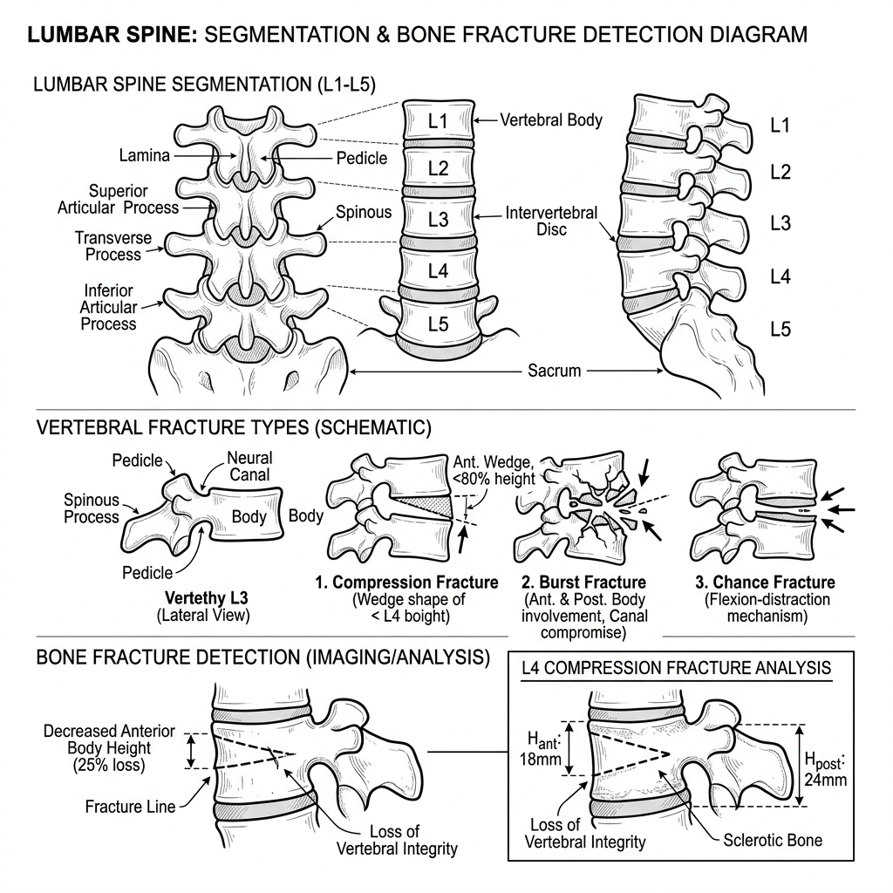

# 🩻 RSNA 2024 — Lumbar Spine Degenerative Classification

     

> [!IMPORTANT]
> **Host:** `Radiological Society of North America (RSNA)`  
> **Platform Link:** [Kaggle Competition](https://www.kaggle.com/competitions/rsna-2024-lumbar-spine-degenerative-classification)  
> **Dataset Link:** [Kaggle Dataset](https://www.kaggle.com/competitions/rsna-2024-lumbar-spine-degenerative-classification/data)  
> **Domain:** `Medical MRI & Radiology`

## 📖 Overview

Classifying degenerative conditions of the lumbar spine from MRI scans. Developed multi-label networks to detect spinal canal stenosis and neural narrowing at different levels.

## ⚙️ Standard Pipeline Workflow

## 🗂️ Notebook Architecture & Inventory

### 📂 Preprocessing & EDA
*Data cleaning, feature engineering, and exploratory data analysis.*

| Script / Notebook | Type | Versions | Average Size | Core Stack / Techniques |
|:------------------|:-----|:---------|:-------------|:------------------------|
| 📄 [Preprocessing](./Preprocessing%20%26%20EDA/Preprocessing.ipynb) | Single Notebook | `v1` | `4 KB` | `DICOM Parsing, OpenCV` |
| 📄 [Preprocessing_2](./Preprocessing%20%26%20EDA/Preprocessing_2.ipynb) | Single Notebook | `v1` | `7 KB` | `DICOM Parsing, OpenCV` |
| 📄 [YOLO_EDA_and_Visualization](./Preprocessing%20%26%20EDA/YOLO_EDA_and_Visualization.ipynb) | Single Notebook | `v1` | `31 KB` | `YOLO Object Detection, OpenCV` |
| 📁 **YOLO_Preprocessing** | Multi-Version Script | [v1](./Preprocessing%20%26%20EDA/YOLO_Preprocessing/v1.ipynb), [v2](./Preprocessing%20%26%20EDA/YOLO_Preprocessing/v2.ipynb), [v3](./Preprocessing%20%26%20EDA/YOLO_Preprocessing/v3.ipynb), [v4](./Preprocessing%20%26%20EDA/YOLO_Preprocessing/v4.ipynb) | `Avg 3 KB` | `YOLO Object Detection, DICOM Parsing, OpenCV` |

### 📂 Training
*Model training and tuning scripts.*

| Script / Notebook | Type | Versions | Average Size | Core Stack / Techniques |
|:------------------|:-----|:---------|:-------------|:------------------------|
| 📄 [EfficientNet_Training](./Training/EfficientNet_Training.ipynb) | Single Notebook | `v1` | `3368 KB` | `smp UNet, PyTorch, OpenCV` |
| 📄 [Training](./Training/Training.ipynb) | Single Notebook | `v1` | `26 KB` | `PyTorch` |

### 📂 Inference & Submission
*Prediction pipeline and Kaggle submission file generation.*

| Script / Notebook | Type | Versions | Average Size | Core Stack / Techniques |
|:------------------|:-----|:---------|:-------------|:------------------------|
| 📁 **Inference** | Multi-Version Script | [v1](./Inference%20%26%20Submission/Inference/v1.ipynb), [v2](./Inference%20%26%20Submission/Inference/v2.ipynb), [v3](./Inference%20%26%20Submission/Inference/v3.ipynb), [v4](./Inference%20%26%20Submission/Inference/v4.ipynb), [v5](./Inference%20%26%20Submission/Inference/v5.ipynb), [v6](./Inference%20%26%20Submission/Inference/v6.ipynb), [v7](./Inference%20%26%20Submission/Inference/v7.ipynb) | `Avg 51 KB` | `PyTorch` |
| 📁 **Inference_2** | Multi-Version Script | [v1](./Inference%20%26%20Submission/Inference_2/v1.ipynb), [v2](./Inference%20%26%20Submission/Inference_2/v2.ipynb), [v3](./Inference%20%26%20Submission/Inference_2/v3.ipynb), [v4](./Inference%20%26%20Submission/Inference_2/v4.ipynb), [v5](./Inference%20%26%20Submission/Inference_2/v5.ipynb), [v6](./Inference%20%26%20Submission/Inference_2/v6.ipynb), [v7](./Inference%20%26%20Submission/Inference_2/v7.ipynb) | `Avg 61 KB` | `PyTorch, DICOM Parsing, OpenCV` |

---

## 🚀 Navigation & Usage Guidelines

> [!TIP]
> 1. **EDA & Preprocessing**: Verify data loaders, actigraphy or DICOM image transformations before model training.
> 2. **Training & Optimization**: Check model definition parameters and training logs to reproduce network weights.
> 3. **Inference & Post-Processing**: Run final pipelines to verify predictions and check submission formats.

---

> *"We slice the spine in shades of grey, locating the quiet degeneration of time."*
>
> — **Vigneshwaran S**
