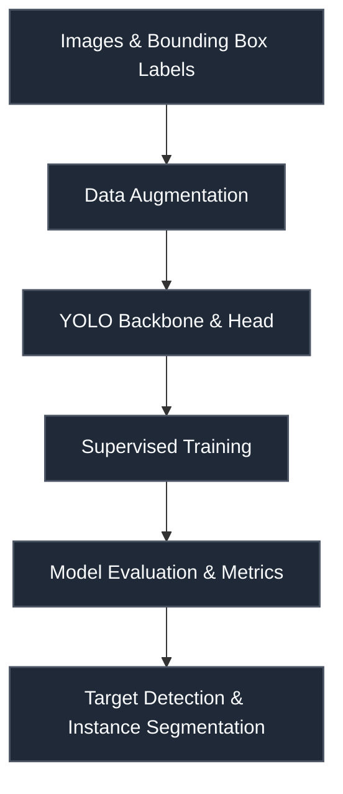

# RSNA 2024 — Lumbar Spine Degenerative Classification

 

> **Host:** [`Radiological Society of North America (RSNA)`]  
> **Platform Link:** [Kaggle Competition](https://www.kaggle.com/competitions/rsna-2024-lumbar-spine-degenerative-classification)  
> **Dataset Link:** [Kaggle Dataset](https://www.kaggle.com/competitions/rsna-2024-lumbar-spine-degenerative-classification/data)  
> **Domain:** `Medical MRI & Radiology`

## Overview

This repository contains the developmental workspace and notebooks for the **RSNA 2024 — Lumbar Spine Degenerative Classification** project. The primary focus of this project is in the domain of **Medical MRI & Radiology** on Radiological Society of North America (RSNA). The codebase represents an iterative implementation of machine learning pipelines, structured to process datasets, train models, and validate predictions.

### Technical Methodology & Implementation

The codebase features a total of 136 cells across 23 notebook(s). The system implements several key architectural elements:
- **Core Classes**: Custom object-oriented structures are defined to manage state and logic, including: `Discriminator`, `customiser`.
- **Key Algorithms & Utilities**: Procedural helpers and utilities facilitate operations, notably: `__init__`, `apply_windowing`, `build_model`, `convert`, `forward`, `image_extracter`, `load_model`, `loss_optimizer`.
- **Training & Optimization**: Includes optimization via Adam.

## System Architecture

## Notebook Architecture

### Preprocessing & EDA

| Notebook / Script | Type | Versions | Average Size | Core Stack / Techniques |
| :--- | :--- | :--- | :--- | :--- |
| [Preprocessing](./Preprocessing%20%26%20EDA/Preprocessing.ipynb) | Single Notebook | v1 | 4 KB | OpenCV |
| [Preprocessing_2](./Preprocessing%20%26%20EDA/Preprocessing_2.ipynb) | Single Notebook | v1 | 7 KB | OpenCV |
| [YOLO_EDA_and_Visualization](./Preprocessing%20%26%20EDA/YOLO_EDA_and_Visualization.ipynb) | Single Notebook | v1 | 31 KB | OpenCV, YOLO Object Detection |
| **YOLO_Preprocessing** | Multi-Version Script | [v1](./Preprocessing%20%26%20EDA/YOLO_Preprocessing/v1.ipynb), [v2](./Preprocessing%20%26%20EDA/YOLO_Preprocessing/v2.ipynb), [v3](./Preprocessing%20%26%20EDA/YOLO_Preprocessing/v3.ipynb), [v4](./Preprocessing%20%26%20EDA/YOLO_Preprocessing/v4.ipynb) | 4 KB | OpenCV, YOLO Object Detection |

### Training

| Notebook / Script | Type | Versions | Average Size | Core Stack / Techniques |
| :--- | :--- | :--- | :--- | :--- |
| [EfficientNet_Training](./Training/EfficientNet_Training.ipynb) | Single Notebook | v1 | 3.3 MB | OpenCV, PyTorch, Scikit-Learn, UNet Segmentation |
| [Training](./Training/Training.ipynb) | Single Notebook | v1 | 26 KB | PyTorch |

### Inference & Submission

| Notebook / Script | Type | Versions | Average Size | Core Stack / Techniques |
| :--- | :--- | :--- | :--- | :--- |
| **Inference** | Multi-Version Script | [v1](./Inference%20%26%20Submission/Inference/v1.ipynb), [v2](./Inference%20%26%20Submission/Inference/v2.ipynb), [v3](./Inference%20%26%20Submission/Inference/v3.ipynb), [v4](./Inference%20%26%20Submission/Inference/v4.ipynb), [v5](./Inference%20%26%20Submission/Inference/v5.ipynb), [v6](./Inference%20%26%20Submission/Inference/v6.ipynb), [v7](./Inference%20%26%20Submission/Inference/v7.ipynb) | 51 KB | OpenCV, PyTorch |
| **Inference_2** | Multi-Version Script | [v1](./Inference%20%26%20Submission/Inference_2/v1.ipynb), [v2](./Inference%20%26%20Submission/Inference_2/v2.ipynb), [v3](./Inference%20%26%20Submission/Inference_2/v3.ipynb), [v4](./Inference%20%26%20Submission/Inference_2/v4.ipynb), [v5](./Inference%20%26%20Submission/Inference_2/v5.ipynb), [v6](./Inference%20%26%20Submission/Inference_2/v6.ipynb), [v7](./Inference%20%26%20Submission/Inference_2/v7.ipynb) | 61 KB | OpenCV, PyTorch |

## Navigation Guidelines

> **Stage Guidelines**
>
- **EDA & Preprocessing**: Verify data loaders and inspect class distributions before model design.
- **Training & Validation**: Check training runs, loss curves, and model validation scores to evaluate performance.
- **Inference & Ensembling**: Run predictions on testing files and verify submission formatting.

---

> "We slice the spine in shades of grey, locating the quiet degeneration of time."
>
> — **Vigneshwaran S**
